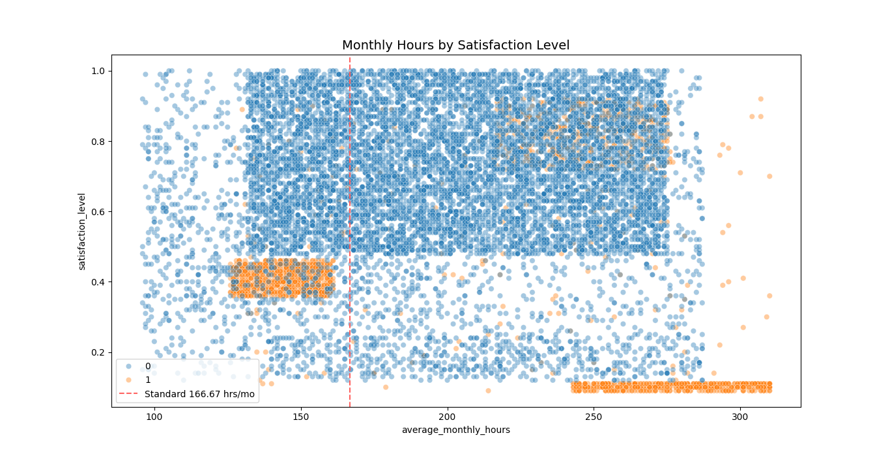
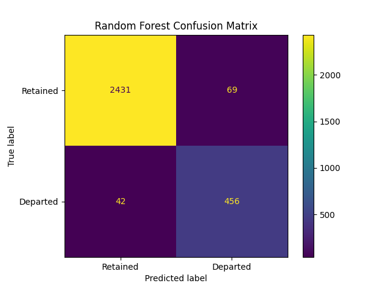

# Employee Turnover Prediction: HR Analytics & Machine Learning

## 📌 Project Overview
High employee turnover represents a significant cost to organizations in terms of recruitment, training, and lost productivity. This project leverages human resources data to identify the key drivers of employee attrition and builds a predictive machine learning model to flag employees who are at high risk of leaving the company. 

## 🎯 Business Objectives
* Conduct Exploratory Data Analysis (EDA) to uncover trends and correlations driving employee dissatisfaction and turnover.
* Engineer features from existing HR metrics (such as evaluation scores, working hours, and project loads).
* Develop and evaluate machine learning classification models to accurately predict the binary target variable (`left`).
* Provide actionable, data-driven recommendations to HR stakeholders to improve retention strategies.

## 📊 The Dataset
The dataset contains employee performance and demographic metrics. During the data cleaning phase, variables were standardized for consistency:
* **Target Variable:** `left` (0 = Stayed, 1 = Left)
* **Key Features:** `satisfaction_level`, `last_evaluation`, `number_project`, `average_monthly_hours`, `tenure`, `work_accident`, `promotion_last_5years`, `department`, `salary`

## 🛠️ Tools & Methodology
* **Language:** Python
* **Libraries:** `pandas`, `numpy` (Data Manipulation) | `matplotlib`, `seaborn` (Data Visualization) | `scikit-learn` (Machine Learning)
* **Models Evaluated:** Logistic Regression, Decision Trees, and Random Forest.
* **Evaluation Metrics:** Precision, Recall, F1-Score, and AUC-ROC, with a specific focus on Recall to ensure at-risk employees are accurately captured.

## 📂 Repository Structure
* `data/`: Contains the HR dataset (`.csv`). 
* `scripts/`: Python script (`.py`) detailing the data cleaning, EDA, model building, and evaluation process.
* `presentations/`: Executive summary detailing the model's findings and strategic HR recommendations.
* `images/`: Saved visualizations used in the README and presentation.

## 📈 Visualizing the Problem & The Solution

### 1. The Burnout Indicator
*The scatterplot below reveals a massive cluster of employees who left the company (orange) working over 240 hours per month with plunging satisfaction levels.*

### 2. Model Accuracy (Random Forest Confusion Matrix)
*The final Random Forest model successfully predicts the vast majority of employees who are at risk of leaving, minimizing costly false negatives.*

## 💡 Key Insights & Recommendations
1. **Burnout Indicator:** Employees with a high `number_project` and high `average_monthly_hours` show a significantly higher probability of leaving.
2. **The "Overworked & Under-Rewarded" Segment:** High-performing employees (high `last_evaluation`) with low `satisfaction_level` are a primary flight risk.
3. **Strategic Action:** HR should implement project workload caps and review compensation/promotion structures for top performers to mitigate burnout and turnover.
